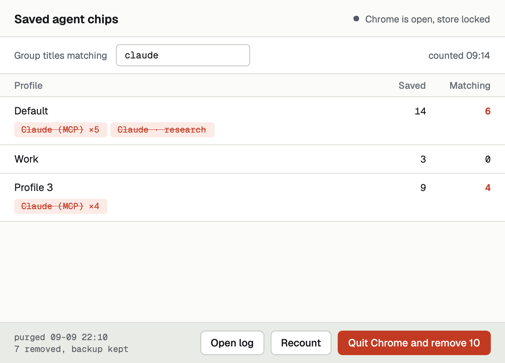

# Claude Sweeper

Chrome saves every tab group it creates. Close the group and it stays behind as a chip in the
bookmarks bar, and no extension can delete it. AI agents that drive Chrome, Claude in Chrome
among them, open a fresh tab group for every session, so the chips pile up for ever.

Claude Sweeper removes them. It reads each Chrome profile's sync store, lists the saved groups
whose title matches a pattern (`claude` by default), and deletes them, with Chrome closed and a
backup taken first.



It is not affiliated with or endorsed by Anthropic.

## Download

Get the latest build from [Releases](https://github.com/TK9443/claude-sweeper/releases/latest).

- **macOS** (Apple silicon, macOS 12 or later): open the `.dmg` and drag Claude Sweeper to
  Applications. It is signed and notarised.
- **Windows** (10 or 11, x64): run the setup program. It installs for your user only, with Start
  Menu and desktop shortcuts. The installer is not code-signed, so Windows SmartScreen may warn
  before it runs; choose More info, then Run anyway.

Everything it needs is bundled, Node included.

## Use

The app lives in the menu bar (macOS) or the notification area (Windows). Its window shows each
profile's saved groups, the ones matching your pattern struck through, and a button that says
exactly how many it will remove. Chrome holds the store locked while it runs, so the app offers to
quit Chrome, do the work, and reopen it. Count first to see what would go; the remove button only
turns red once a count for the current pattern has found something. Start it with `--hidden` to go
straight to the tray.

Its safeguards:

- It refuses to touch a store while Chrome is open, because a half-written store is a corrupt profile.
- Before deleting, it copies each profile's store to `~/Library/Application Support/Claude Sweeper/backups`
  (macOS) or `%LOCALAPPDATA%\Claude Sweeper\backups` (Windows). Copies older than fourteen days are
  removed at the start of the next deleting run.
- A pattern that would match an empty title, and so every group, is refused.

## The purge on its own

The engine is a single Node script and can run without the app, for example at login:

```sh
cd purge && npm ci
node purge.mjs                      # dry run: list what would go
node purge.mjs --delete             # remove matching saved groups
node purge.mjs --match 'claude|codex' --delete
node purge.mjs --profile "/path/to/Chrome/Profile 1"
node purge.mjs --delete --log ~/Library/Logs/Claude\ Sweeper/purge.log
```

To run it at login, point a LaunchAgent (macOS) or a scheduled task (Windows) at `node purge.mjs
--delete --log <file>`. The app reads the same log, so a purge that ran unseen shows up in its
window.

## Build from source

Needs [uv](https://docs.astral.sh/uv/) and an official [Node.js](https://nodejs.org/) 22 or later
on both platforms, and [Inno Setup 6](https://jrsoftware.org/isinfo.php) on Windows. The build
bundles that Node into the app.

- **macOS**: `./build.sh` builds `Claude Sweeper.app`, signs it ad-hoc (set
  `CLAUDE_SWEEPER_SIGN_IDENTITY` to use a real identity), installs it to `/Applications` and
  launches it. `--no-install` stops after the build; `--no-pin` leaves the Dock alone. `--dmg`
  builds a release disk image instead, notarised when `CLAUDE_SWEEPER_NOTARY_PROFILE` names a
  `notarytool` keychain profile.
- **Windows**: `install.ps1` builds the installer and installs it. `-NoLaunch` skips starting it
  afterwards; `build.ps1` alone stops at the installer.

Test: `uv run python tests/test_close_shortcut.py`

## Licence

[MIT](LICENSE). The bundled Geist and Geist Mono fonts are under the SIL Open Font License; see
`assets/fonts/OFL.txt`. The bundled Node.js is under its own MIT licence.
